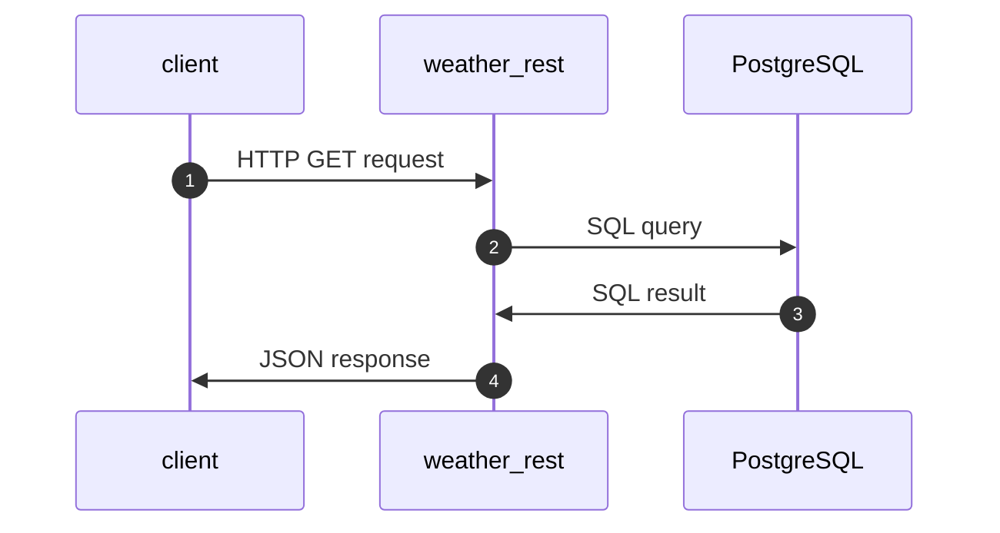

REST-endpoints for weather-data from Statens Vegvesen.

```mermaid
sequenceDiagram
autonumber
client->>weather_rest: HTTP GET request
weather_rest->>PostgreSQL: SQL query
PostgreSQL->>weather_rest: SQL result
weather_rest->>client: JSON response
```